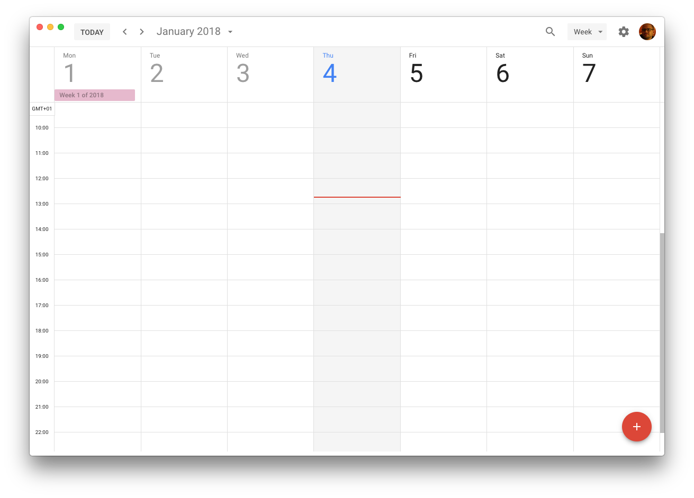

# Google Calendar packaged as electron app

Thin wrapper around the Google Calendar web interface built with
[electron](http://electron.atom.io/).



## Download

Pre-built binary release for MacOS: [Google-Calendar-v.1.0.0-Mac.zip](https://github.com/fgnass/google-calendar-app/releases/download/v1.0.0/Google-Calendar-v.1.0.0-Mac.zip)

## Build from source

```
npm install
npm run pack-osx
cp -r Google\ Calendar-darwin-x64/Google\ Calendar.app /Applications
```

# Disclaimer

This project is not affiliated with, associated to, nor endorsed by Google
in any way. Google and the Google Calendar Logo are registered 
trademarks of Google Inc.

The code in this repository has been released to the public domain
under the [UNLICENSE](./UNLICENSE).
